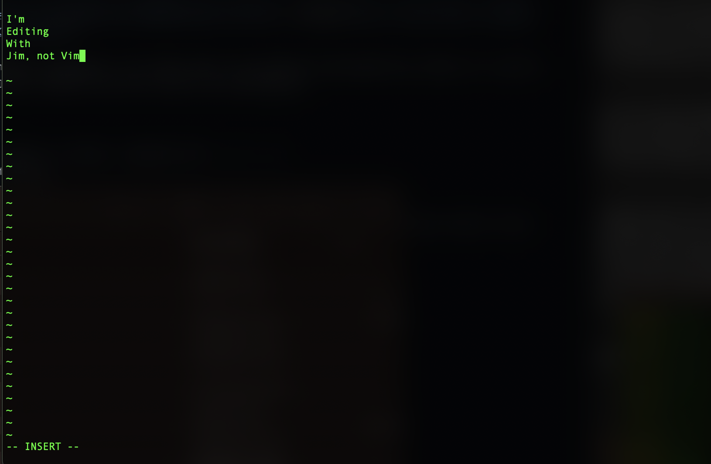

# Jim - A "Revolutionary" "Text Editor"

 

Brilliant text editor written in C++ with (mostly) ✨*manual memory management* ✨!!

Jim is obviously a Vim clone and by clone I mean a horrible demonic imitation.

It might clear your file on write so only test this on dummy files and if you delete your favourite .cpp file I won't be held liable as this software is provided as is with no warranties or guarantees.

### Features

1. :fire: M E M O R Y S A F E T Y :fire: (will segfault at some point)
2. An abomination of C and C++ coding conventions + extra spice (my ineptitude) :+1:
3. Brilliant text editing functionalities ~~(Only ASCII characters supported) :sunglasses:~~ BOTCHED UTF-8 SUPPORT :speaking_head:
4. NOW FEATURING WRITE AND QUIT COMMANDS!!!!! :fire: :fire: :tada: :tada:

### FAQ

**Q: Can I use Jim for serious work?**  
A: Only if your definition of serious includes data loss.

**Q: How stable is Jim?**  
A: Emotionally? Not at all. Technically? Still no.

**Q: Why did you write this?**  
A: I was left unattended with a C++ compiler and a terminal emulator.
